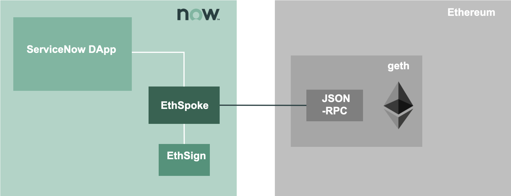
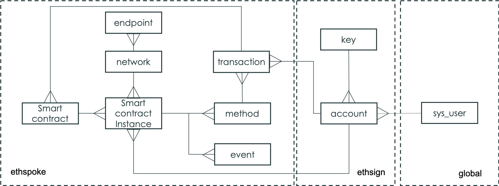

# EthNow

The EthNow project aims to create a production-ready Ethereum integration for ServiceNow. 

The integration works with the public Ethereum networks as well as private networks based on Ethereum-compatible enterprise blockchain clients like Consensys Quorum and Hyperledger Besu.

EthNow is focused on a server-side implementation based on [Flow Designer](https://docs.servicenow.com/bundle/paris-servicenow-platform/page/administer/flow-designer/concept/flow-designer.html) and [Integration Hub](https://docs.servicenow.com/bundle/paris-servicenow-platform/page/administer/integrationhub/concept/integrationhub.html).

The client-side integration is also doable and desirable. Check [this link](https://www.linkedin.com/pulse/servicenow-non-fungible-tokens-enterprise-ethereum-nicola-attico/) for an example of a client-side integration using MetaMask.

All modules can operate in a totally self-contained way withing the ServiceNow instance, without the need of any external component, including the MID server.

The project contains the following repositories:
- [EthSign](ethsign.md). A signer based on the ServiceNow platform.
- EthSpoke. The Ethereum spoke, that used ethsign to sign transaction and to provision cryptographic key pairs to ServiceNow users
- NowToken. An example application that is based on ethnow and that implement a token NOW that can be exchanged within and across customer instances.

## High-level architecture

EthNow is made of two ServiceNow scoped applications:
- ethsign, which is an Ethereum signer built in ServiceNow. Ethsign implements a permissioned approach to blockchain, where each user can access a defined set of key pairs that are stored in the ServiceNow instance.
- ethspoke, which is the actual integration that can enable an ecosystem of ServiceNow based DApps, enabling blockchain users and developers to leverage the low-code capabilities of the Now Platform

In the diagram below, the high-level architecture is represented, where a ServiceNow Dapp interact with the Ethereum node through ethspoke. Ethspoke uses ethsign in order to sign transactions and talk with the node via JSON-RPC APIs. Multiple instances can connect to different blockchain nodes, that will need to reach consensus for state-changing interactions. 

ServiceNow Dapps (distributed applications) can be developed leveraging ethnow. As part of the ethnow project a sample NowToken application is provided.

The following interactions are implemented by EthSpoke:
- Deploy smart contract
- Invoke method (send)
- Call method (call)

## Detailed description

The entity-relationship diagram depicted in figure represents the tables and references existing in the ethspoke and ethsign scoped applications.

| Entity  | Application |Description |
|---|---|---|
|Network|ethspoke|The list of blockchain networks the instance is interacting with.|
|Endpoint|ethspoke|The list of endpoint that are declared within the instance. Endpoints are ethereum nodes and are tied to a specific instance declared by the app administrator. One network may have one or more nodes defined.|
|Smart Contract|ethspoke|The list of Smart Contracts that are defined in terms of bytecode and ABI. Smart contract are not tied to a specific network.|
|Smart Contract Instance|ethspoke|The list of Smart Contracts deployed on chain. May be deployed from the same instance or deployed from another instance and declared in the current instance |
|Method|ethspoke|A method of the smart contract instance, depending on the ABI declared on the smart contract.
|Event|ethspoke|An event that the smart contract instance can fire, depending on the ABI declared on the smart contract.
|Transaction|ethspoke|The log of a transaction invoked from the instance. It can be either a smart contract deployment transaction or a method invocation (send)|
|Key|ethsign|A private and public keypair, and the associated address. The private key is protected by a read ACL that only the ethsign administrator (if any) can modify. The ethsign admin represent the custodian.
|Account|ethsign|The relationship table between keypairs and instance users. Each user is identified depending on the ServiceNow login id and can have zero,  one or more keys assigned to him, with which he will be able to sign transactions. |

The ethnow project uses the primitives provided by the [ethjs](https://github.com/ethjs) project.

The following libraries have been adapted/polyfilled to the ServiceNow javascript engine (Rhino 1.7R5 as of the Paris release) and embedded in the applications as script include:

| Library | Purpose | Adaptations |
|---|---|---|
|ethjs-signer| Sign Ethereum transactions||
|ethjs-account| Generate key pairs and manage accounts||
|ethjs-abi| Encoding and decoding utilities||
|ethjs-format| Payload formatter for the Ethereum RPC layer ||
|ethjs-unit| Manage crypto units | Need to set Buffer.TYPED_ARRAY_SUPPORT = false;|

Libraries' global variables have been mangles using [obfuscator.io](https://obfuscator.io/) using this configuration:

The ethnow spoke talk with the Ethereum node(s) through the node JSON-RPC API.

## Security

## How to use

### How to install
You can install the update set provided on ...

### How to test
How to submit the main workflow using the pre-packaged smart contract

### How to contribute

